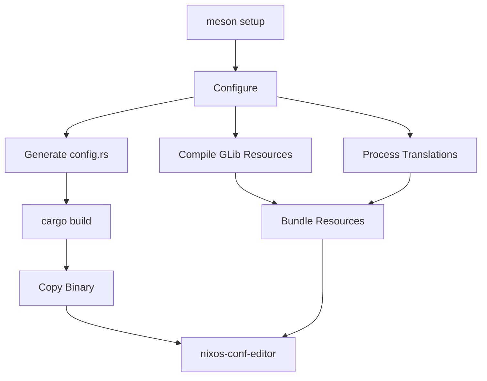

## Prerequisites

Building NixOS Configuration Editor requires several development tools and libraries:

<CardGroup cols={2}>
  <Card title="Rust Toolchain" icon="rust">
    Rust 1.56 or later with Cargo
  </Card>
  <Card title="Meson Build System" icon="gear">
    Meson 0.59 or later
  </Card>
  <Card title="GTK4 Development" icon="code">
    GTK 4.6+ and libadwaita 1.2+ with headers
  </Card>
  <Card title="Additional Tools" icon="wrench">
    glib-compile-resources, cargo, desktop-file-validate
  </Card>
</CardGroup>

## NixOS Installation

The easiest way to set up a development environment on NixOS:

<CodeGroup>
```nix shell.nix
{ pkgs ? import <nixpkgs> {} }:

pkgs.mkShell {
  buildInputs = with pkgs; [
    # Build system
    meson
    ninja
    pkg-config
    
    # Rust toolchain
    cargo
    rustc
    
    # GTK4 and dependencies
    gtk4
    libadwaita
    gtksourceview5
    vte-gtk4
    
    # Additional libraries
    openssl
    glib
    polkit
    
    # Development tools
    desktop-file-utils
    appstream-glib
  ];
  
  # Set up environment variables
  shellHook = ''
    export RUST_LOG=nixos_conf_editor=debug
  '';
}
```

```bash Development Shell
nix-shell
```
</CodeGroup>

<Note>
This shell environment provides all necessary dependencies. You can also use `nix develop` if you're using flakes.
</Note>

## System Dependencies

The build system verifies these dependencies at configure time:

```python meson.build
dependency('openssl', version: '>= 1.0')
dependency('glib-2.0', version: '>= 2.66')
dependency('gio-2.0', version: '>= 2.66')
dependency('gtk4', version: '>= 4.6.0')
dependency('libadwaita-1', version: '>=1.2.0')
dependency('polkit-gobject-1', version: '>= 0.103')
```

<Tabs>
  <Tab title="Ubuntu/Debian">
    ```bash
    sudo apt install meson cargo rustc \
      libgtk-4-dev libadwaita-1-dev \
      libgtksourceview-5-dev libvte-2.91-gtk4-dev \
      libssl-dev libpolkit-gobject-1-dev \
      desktop-file-utils appstream-util
    ```
  </Tab>
  
  <Tab title="Fedora">
    ```bash
    sudo dnf install meson cargo rust \
      gtk4-devel libadwaita-devel \
      gtksourceview5-devel vte291-gtk4-devel \
      openssl-devel polkit-devel \
      desktop-file-utils libappstream-glib
    ```
  </Tab>
  
  <Tab title="Arch Linux">
    ```bash
    sudo pacman -S meson cargo rust \
      gtk4 libadwaita \
      gtksourceview5 vte4 \
      openssl polkit \
      desktop-file-utils appstream-glib
    ```
  </Tab>
</Tabs>

## Building the Application

<Steps>
  <Step title="Clone the Repository">
    ```bash
    git clone https://github.com/snowfallorg/nixos-conf-editor
    cd nixos-conf-editor
    ```
  </Step>
  
  <Step title="Configure with Meson">
    ```bash
    meson setup build
    ```
    
    This creates a `build` directory and configures the project. For a development build with debug symbols:
    
    ```bash
    meson setup build --buildtype=debug -Dprofile=development
    ```
  </Step>
  
  <Step title="Compile the Project">
    ```bash
    meson compile -C build
    ```
    
    Or using ninja directly:
    
    ```bash
    ninja -C build
    ```
  </Step>
  
  <Step title="Run the Application">
    ```bash
    ./build/src/nixos-conf-editor
    ```
    
    For verbose logging:
    
    ```bash
    RUST_LOG=nixos_conf_editor=trace ./build/src/nixos-conf-editor
    ```
  </Step>
</Steps>

## Build Profiles

The build system supports two profiles:

<Tabs>
  <Tab title="Release Profile">
    ```bash
    meson setup build --buildtype=release
    ```
    
    - Optimized compilation (`--release` passed to Cargo)
    - Smaller binary size
    - No debug symbols
    - Application ID: `dev.vlinkz.NixosConfEditor`
  </Tab>
  
  <Tab title="Development Profile">
    ```bash
    meson setup build --buildtype=debug -Dprofile=development
    ```
    
    - Debug compilation (faster builds)
    - Debug symbols included
    - Additional development features enabled
    - Application ID: `dev.vlinkz.NixosConfEditor.Devel`
    - Version suffix includes git commit hash
  </Tab>
</Tabs>

<Info>
The development profile uses a different application ID, allowing you to run development and release versions side-by-side without conflicts.
</Info>

## Build System Architecture

The build process coordinates multiple tools:



### Configuration Generation

```python src/meson.build
global_conf = configuration_data()
global_conf.set_quoted('APP_ID', application_id)
global_conf.set_quoted('PKGDATADIR', pkgdatadir)
global_conf.set_quoted('PROFILE', profile)
global_conf.set_quoted('VERSION', version + version_suffix)
global_conf.set_quoted('GETTEXT_PACKAGE', gettext_package)
global_conf.set_quoted('LOCALEDIR', localedir)
global_conf.set_quoted('LIBEXECDIR', libexecdir)

config = configure_file(
  input: 'config.rs.in',
  output: 'config.rs',
  configuration: global_conf
)
```

This generates a `config.rs` file with build-time constants:

```rust src/config.rs.in
pub const APP_ID: &str = "@APP_ID@";
pub const PKGDATADIR: &str = "@PKGDATADIR@";
pub const VERSION: &str = "@VERSION@";
pub const GETTEXT_PACKAGE: &str = "@GETTEXT_PACKAGE@";
pub const LOCALEDIR: &str = "@LOCALEDIR@";
pub const LIBEXECDIR: &str = "@LIBEXECDIR@";
```

### Cargo Integration

```python src/meson.build
cargo_options = [ '--manifest-path', meson.project_source_root() / 'Cargo.toml' ]
cargo_options += [ '--target-dir', meson.project_build_root() / 'src' ]

if get_option('profile') == 'default'
  cargo_options += [ '--release' ]
  rust_target = 'release'
else
  rust_target = 'debug'
endif

cargo_build = custom_target(
  'cargo-build',
  build_by_default: true,
  build_always_stale: true,
  output: meson.project_name(),
  console: true,
  install: true,
  install_dir: bindir,
  command: [
    'env',
    'CARGO_HOME=' + meson.project_build_root() / 'cargo-home',
    cargo, 'build',
    cargo_options,
    '&&',
    'cp', 'src' / rust_target / meson.project_name(), '@OUTPUT@',
  ]
)
```

<Warning>
The build system sets `CARGO_HOME` to avoid conflicts with user's global Cargo cache. Dependencies are downloaded to `build/cargo-home`.
</Warning>

## Installing

<Tabs>
  <Tab title="System Installation">
    ```bash
    meson install -C build
    ```
    
    Installs to system directories:
    - Binary: `/usr/bin/nixos-conf-editor`
    - Helper: `/usr/libexec/nce-helper`
    - Desktop file: `/usr/share/applications/`
    - Icons: `/usr/share/icons/`
  </Tab>
  
  <Tab title="Custom Prefix">
    ```bash
    meson setup build --prefix=/usr/local
    meson install -C build
    ```
    
    Or for user-local installation:
    
    ```bash
    meson setup build --prefix=$HOME/.local
    meson install -C build
    ```
  </Tab>
</Tabs>

## Development Workflow

### Incremental Builds

After making changes to Rust code:

```bash
meson compile -C build
```

Meson automatically detects which files changed and only rebuilds what's necessary.

### Running Tests

```bash
cargo test --manifest-path=Cargo.toml
```

### Code Formatting

```bash
cargo fmt --manifest-path=Cargo.toml
```

### Linting

```bash
cargo clippy --manifest-path=Cargo.toml
```

<Tip>
Set up a pre-commit hook to automatically format code:

```bash .git/hooks/pre-commit
#!/bin/sh
cargo fmt --manifest-path=Cargo.toml -- --check
```
</Tip>

## Debugging

### Enable Debug Logging

```bash
RUST_LOG=nixos_conf_editor=trace ./build/src/nixos-conf-editor
```

Log levels: `error`, `warn`, `info`, `debug`, `trace`

### GTK Inspector

Launch with GTK Inspector for UI debugging:

```bash
GTK_DEBUG=interactive ./build/src/nixos-conf-editor
```

### Using GDB

```bash
gdb ./build/src/nixos-conf-editor
(gdb) run
```

### Rust Backtrace

```bash
RUST_BACKTRACE=1 ./build/src/nixos-conf-editor
```

## Distribution Tarball

Create a source distribution:

```bash
meson dist -C build
```

This creates a tarball in `build/meson-dist/` with:
- All source files
- Vendored Rust dependencies (via `build-aux/dist-vendor.sh`)
- Version information

<Note>
The `dist-vendor.sh` script runs `cargo vendor` to include all Rust dependencies, making the tarball self-contained for offline builds.
</Note>

## Common Issues

<AccordionGroup>
  <Accordion title="Missing GTK4 or libadwaita">
    **Error**: `Dependency "gtk4" not found`
    
    **Solution**: Install GTK4 development packages for your distribution. Make sure you have both the runtime libraries and development headers.
    
    ```bash
    # Verify installation
    pkg-config --modversion gtk4
    pkg-config --modversion libadwaita-1
    ```
  </Accordion>
  
  <Accordion title="Cargo not in PATH">
    **Error**: `Program 'cargo' not found`
    
    **Solution**: Install Rust using rustup:
    
    ```bash
    curl --proto '=https' --tlsv1.2 -sSf https://sh.rustup.rs | sh
    source $HOME/.cargo/env
    ```
  </Accordion>
  
  <Accordion title="OpenSSL Linking Errors">
    **Error**: `could not find native static library openssl`
    
    **Solution**: Install OpenSSL development package:
    
    ```bash
    # Ubuntu/Debian
    sudo apt install libssl-dev
    
    # Fedora
    sudo dnf install openssl-devel
    ```
  </Accordion>
  
  <Accordion title="Permission Denied on Helper Binary">
    **Error**: Helper binary can't execute with elevated privileges
    
    **Solution**: The helper needs to be installed with proper permissions and PolicyKit configuration. Use `meson install` to install system-wide, or set up PolicyKit rules manually for development builds.
  </Accordion>
</AccordionGroup>

## Next Steps

<CardGroup cols={2}>
  <Card title="Architecture Overview" icon="diagram-project" href="./overview">
    Understand the application's architecture and technology stack
  </Card>
  
  <Card title="UI Components" icon="layer-group" href="./ui-components">
    Learn about the Relm4 component system
  </Card>
  
  <Card title="Contributing Guide" icon="code-pull-request" href="../contributing">
    Guidelines for contributing to the project
  </Card>
  
  <Card title="API Documentation" icon="book" href="../api/overview">
    Browse the API reference
  </Card>
</CardGroup>

## Additional Resources

<Card title="Report Issues" icon="bug" href="https://github.com/snowfallorg/nixos-conf-editor/issues">
  Found a bug or have a feature request? Open an issue on GitHub.
</Card>