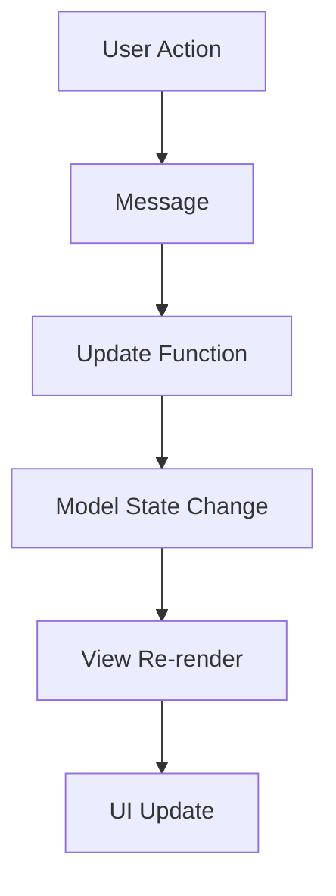

## Introduction

NixOS Configuration Editor is a desktop application built with modern Rust technologies, providing a graphical interface for managing NixOS system configurations. The application leverages the GNOME ecosystem's latest technologies to deliver a native, responsive user experience.

## Technology Stack

The application is built on a carefully selected stack of cutting-edge technologies:

<CardGroup cols={2}>
  <Card title="Relm4" icon="diagram-project">
    Reactive UI framework providing an Elm-inspired architecture for GTK4 applications
  </Card>
  <Card title="libadwaita" icon="palette">
    GNOME's modern widget library delivering adaptive, beautiful interfaces
  </Card>
  <Card title="GTK4" icon="window-maximize">
    The latest version of the GNOME toolkit with improved performance and features
  </Card>
  <Card title="Rust" icon="rust">
    Memory-safe systems programming language ensuring reliability and performance
  </Card>
</CardGroup>

## Workspace Structure

The project uses a Cargo workspace with two distinct packages:

```toml Cargo.toml
[workspace]
members = [".", "nce-helper"]
default-members = [".", "nce-helper"]
```

<AccordionGroup>
  <Accordion title="Main Application (nixos-conf-editor)">
    The primary GUI application that users interact with. It handles:
    - User interface rendering and interaction
    - Configuration parsing and display
    - Option browsing and searching
    - Configuration editing interface
    
    **Entry Point**: `src/main.rs:12`
  </Accordion>

  <Accordion title="Helper Binary (nce-helper)">
    A privileged helper program that performs system operations:
    - Writing configuration files with elevated permissions
    - Executing `nixos-rebuild` commands
    - Managing system-level configuration changes
    
    This separation ensures the main GUI runs with user privileges while system modifications are handled securely.
  </Accordion>
</AccordionGroup>

## Key Dependencies

### Core UI Framework

<CodeGroup>
```toml Relm4 Framework
relm4 = { version = "0.5.1", features = ["libadwaita"] }
relm4-components = { version = "0.5.1" }
```

```toml GNOME Libraries
adw = { package = "libadwaita", version = "0.2", features = ["v1_2", "gtk_v4_6"] }
gtk = { package = "gtk4", version = "0.5", features = ["v4_6"] }
```
</CodeGroup>

Relm4 provides the reactive architecture that powers the application's UI. It implements an Elm-inspired Model-View-Update pattern, making the UI predictable and maintainable.

### Configuration Editing

```toml Cargo.toml
nix-editor = "0.3.0"
nix-data = "0.0.3"
```

<Info>
**nix-editor** handles the actual manipulation of Nix expressions, allowing the application to read and modify configuration files while preserving formatting and structure.

**nix-data** provides access to NixOS option metadata and type information.
</Info>

### Advanced UI Components

<Tabs>
  <Tab title="Source Editor">
    ```toml
    sourceview5 = { version = "0.5", features = ["v5_4"] }
    ```
    
    Provides syntax highlighting for Nix code, making configuration values easier to read and edit. Supports both light and dark color schemes.
  </Tab>
  
  <Tab title="Terminal Emulator">
    ```toml
    vte = { package = "vte4", version = "0.5" }
    ```
    
    Embeds a terminal for displaying `nixos-rebuild` output in real-time, giving users immediate feedback during system rebuilds.
  </Tab>
</Tabs>

### Documentation & Formatting

```toml Cargo.toml
html2pango = "0.5"
pandoc = "0.8"
```

Option descriptions are written in Markdown. The application uses Pandoc to convert Markdown to HTML, then html2pango to convert HTML to Pango markup for GTK display.

### Async Runtime

```toml Cargo.toml
tokio = { version = "1.24", features = ["rt", "macros", "time", "rt-multi-thread", "sync"] }
```

Tokio provides the asynchronous runtime for non-blocking operations like loading configuration files and parsing large option databases.

## Build System

The project uses **Meson** as its build system, which coordinates both the Rust compilation (via Cargo) and resource compilation (via glib-compile-resources).

<Steps>
  <Step title="Configuration">
    Meson generates configuration files with build-time constants like application ID, version, and installation paths.
  </Step>
  
  <Step title="Resource Compilation">
    GLib resource compiler bundles UI definitions, icons, and other assets into the binary.
  </Step>
  
  <Step title="Rust Compilation">
    Cargo builds both the main application and nce-helper binary with appropriate optimization flags.
  </Step>
  
  <Step title="Installation">
    Meson installs binaries, desktop files, and resources to system directories.
  </Step>
</Steps>

<Note>
The dual build system approach (Meson + Cargo) is standard for GNOME applications written in Rust, ensuring proper integration with system package managers and desktop environments.
</Note>

## Application Lifecycle

The application follows GTK's standard application lifecycle:

```rust src/main.rs
fn main() {
    gtk::init().unwrap();
    pretty_env_logger::init();
    setup_gettext();
    glib::set_application_name(&gettext("Configuration Editor"));
    let app = adw::Application::new(Some(APP_ID), gio::ApplicationFlags::empty());
    app.set_resource_base_path(Some("/dev/vlinkz/NixosConfEditor"));
    app.set_accelerators_for_action::<SearchAction>(&["<Control>f"]);
    let app = RelmApp::with_app(app);
    app.run::<AppModel>(());
}
```

<Steps>
  <Step title="GTK Initialization">
    Initialize the GTK library and set up logging with `pretty_env_logger`.
  </Step>
  
  <Step title="Localization">
    Set up gettext for internationalization support.
  </Step>
  
  <Step title="Application Setup">
    Create the Adwaita application instance with the appropriate application ID.
  </Step>
  
  <Step title="Resource Path">
    Configure the resource base path for bundled assets.
  </Step>
  
  <Step title="Keyboard Shortcuts">
    Register keyboard accelerators (e.g., Ctrl+F for search).
  </Step>
  
  <Step title="Component Initialization">
    Launch the Relm4 application with the root `AppModel` component.
  </Step>
</Steps>

## Data Flow

The application follows a unidirectional data flow pattern:



<Warning>
All state modifications happen through message passing. Direct state mutations are not allowed, ensuring predictable behavior and easier debugging.
</Warning>

## Project Directory Structure

```
nixos-conf-editor/
├── src/
│   ├── main.rs              # Application entry point
│   ├── ui/                  # UI components
│   │   ├── window.rs        # Main window component
│   │   ├── optionpage.rs    # Option editor page
│   │   ├── searchpage.rs    # Search interface
│   │   └── rebuild.rs       # Rebuild dialog
│   └── parse/               # Configuration parsing
│       ├── config.rs        # Config file operations
│       └── options.rs       # Option metadata
├── nce-helper/              # Privileged helper binary
├── data/                    # Application resources
├── po/                      # Translations
└── meson.build             # Build configuration
```

## Next Steps

<CardGroup cols={2}>
  <Card title="UI Components" icon="layer-group" href="./ui-components">
    Explore the Relm4 component architecture and message passing system
  </Card>
  
  <Card title="Configuration Parsing" icon="file-code" href="./parsing">
    Learn how Nix configurations are parsed and modified
  </Card>
  
  <Card title="Building from Source" icon="hammer" href="./building">
    Set up your development environment and build the application
  </Card>
  
  <Card title="API Reference" icon="book" href="../api/overview">
    Browse the complete API documentation
  </Card>
</CardGroup>